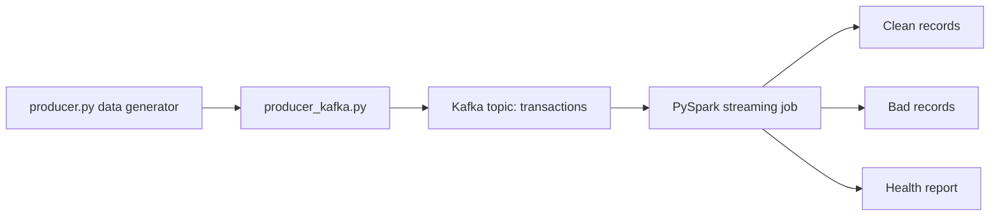

# Mini Kafka PySpark Data Quality Pipeline

A local learning pipeline that generates synthetic transaction data, publishes it to Kafka, validates records with PySpark Structured Streaming, and separates clean records from bad records.

This repository documents the Windows/local development version. For the cleaner Dockerized portfolio version, see:

[mini-kafka-pyspark-docker-pipeline](https://github.com/RaveendraS33/mini-kafka-pyspark-docker-pipeline)

## Why This Project Exists

This project shows the first version of an end-to-end data engineering workflow:

- Generate synthetic transaction events
- Inject intentional data quality issues
- Publish records to Kafka
- Consume records with PySpark Structured Streaming
- Apply validation rules
- Write clean records, bad records, and a health report

## Architecture

```text
producer/producer.py
  -> producer/producer_kafka.py
  -> Kafka topic: transactions
  -> spark_jobs/streaming_cleaning_job.py
  -> output/clean_data
  -> output/bad_records
  -> output/health_report/latest
```



## Project Structure

```text
mini-kafka-pyspark-data-quality-pipeline/
|-- .github/workflows/ci.yml
|-- .env.example
|-- docker-compose.yml
|-- producer/
|   |-- producer.py
|   `-- producer_kafka.py
|-- spark_jobs/
|   `-- streaming_cleaning_job.py
|-- src/
|   `-- quality/
|       `-- rules.py
|-- tests/
|   `-- test_quality_rules.py
|-- requirements.txt
|-- README.md
`-- .gitignore
```

## Setup

Create and activate a virtual environment:

```powershell
python -m venv .venv
.\.venv\Scripts\Activate.ps1
pip install -r requirements.txt
```

Start Kafka:

```powershell
docker compose up -d
docker ps
```

## Windows Spark Note

Running Spark directly on Windows may require:

```text
C:\hadoop\bin\winutils.exe
C:\hadoop\bin\hadoop.dll
```

It may also require `HADOOP_HOME` and `hadoop.home.dir` configuration. This is exactly why the separate Docker repo exists: it avoids Windows-specific Spark setup.

## Configuration

Copy `.env.example` values into your terminal environment or pass command-line flags.

Default values:

```text
KAFKA_TOPIC=transactions
KAFKA_BOOTSTRAP_SERVERS=localhost:9092
PRODUCER_BATCHES=10
PRODUCER_RECORDS_PER_BATCH=10
PRODUCER_BAD_RECORDS_PER_BATCH=3
PRODUCER_SLEEP_SECONDS=1
```

## Run the Pipeline

Start the PySpark streaming job in one terminal:

```powershell
spark-submit `
  --packages org.apache.spark:spark-sql-kafka-0-10_2.13:4.1.2 `
  spark_jobs/streaming_cleaning_job.py
```

In a second terminal, publish synthetic records to Kafka:

```powershell
python producer\producer_kafka.py
```

Optional producer settings:

```powershell
python producer\producer_kafka.py `
  --topic transactions `
  --bootstrap-servers localhost:9092 `
  --batches 10 `
  --records-per-batch 10 `
  --bad-records-per-batch 3 `
  --sleep-seconds 1
```

## Data Quality Rules

A record is marked bad when:

- `transaction_id` is missing
- `user_id` is missing
- `email` is missing or does not contain `@`
- `amount` is missing or less than or equal to zero
- `event_time` is missing

Reusable rule constants and a unit-testable validator live in:

```text
src/quality/rules.py
```

## Expected Output

Spark writes JSON part files under:

```text
output/clean_data/
output/bad_records/
output/health_report/latest/
output/checkpoints/
```

The `output/` folder is ignored by Git because it contains generated runtime data and Spark checkpoints.

## Tests

Run unit tests:

```powershell
pip install -r requirements-dev.txt
python -m pytest tests
```

GitHub Actions also runs the unit tests on push and pull request.

## Important Design Note

`producer/producer.py` is intentionally kept as the original file-based generator because it demonstrates data generation logic. Kafka publishing is added separately in `producer/producer_kafka.py`.

## Current Limitations

This is a local learning repo, not the final production-style version. It does not include Schema Registry, Avro/Protobuf, monitoring, or Spark cluster mode. The Dockerized version is the preferred portfolio version for reproducibility.
